# 清笺课程表

把教务系统导出的课程表 Excel 导入手机，自动解析成一张完整、直观的课表。

不联网、不上传、不收集任何信息，所有数据只保存在本机。

---

## 这是什么

「清笺课程表」是一个本地运行的课程表应用。导入教务系统导出的课程表 Excel 后，它会自动识别表格结构、拆出每门课的上课时间与地点，生成一张可以按周查看的课表，不需要手工录入。

有两种使用方式：

| 版本 | 说明 |
|---|---|
| **安卓版** | 完整功能。数据除本地存储外，还会在应用私有目录保存一份，清理后台不会丢失。 |
| **网页版** | 单个 HTML 文件，双击即可用。不依赖网络，也可以添加到手机主屏幕当作应用使用。 |

## 功能

**课程表**

- 自动识别三种常见的教务系统导出格式：大节网格表、通用网格表、课程明细表；`.xls` 与 `.xlsx` 均支持（按文件内容判断格式，不依赖扩展名）
- 按周查看，可在任意周次之间切换；当前周没有课时自动跳到最近有课的一周
- 课程块按课程名自动配色，同一门课颜色一致
- 点击课程块查看详情：时间、地点、教师、周次
- 日程视图：按天列出当天的课程
- 上下课时间表可自定义，大节会按总时长自动拆分

**多课程表**

- 可分别保存不同学期或不同班级的课程表，随时切换
- 导入时可选「覆盖当前课程表 / 另外开一个课程表 / 合并到当前课程表」

**个人化**

- 昵称、头像、个性签名、生日
- 9 套预设主题，也可以自定义主色与辅色
- 深色模式
- 自定义界面背景图

**数据**

- 导出 `.ics` 日历文件，可导入手机自带日历、谷歌日历或 Outlook
- 导出课表为图片
- 下载导入模板
- 内置「**导入教程**」：一步步说明怎么从教务系统把课表导出来（连校园网 → 智慧校园 → 学期理论课表 → 导出 Excel）
- 导出备份与从备份恢复
- 上课提醒

**设置**

「我的 → 设置」按用途分成 6 个模块，每个模块单独一页，不用在一长条列表里翻找；一级列表上直接显示当前状态（第几周、当前主题、提醒时间等）。

| 模块 | 内容 |
|---|---|
| 学期与节次 | 本周是第几周 / 第 1 周周一 / 总周数 / 学期，以及上下课时间表 |
| 外观 | 深色模式、显示周末、主题色与自定义主色、界面背景图 |
| 上课提醒 | 提前提醒的时间 |
| 数据 | 导入 Excel、导出图片 / 日历 / 备份，从备份恢复、清空 |
| 检查更新 | 查询项目发布记录，可选国内镜像下载并直接调用系统安装器 |
| 关于 | 版本号、开发者署名、开源声明、兼容性说明与隐私政策 |

## 界面

| 课表 | 课程详情 | 日程 |
|---|---|---|
| 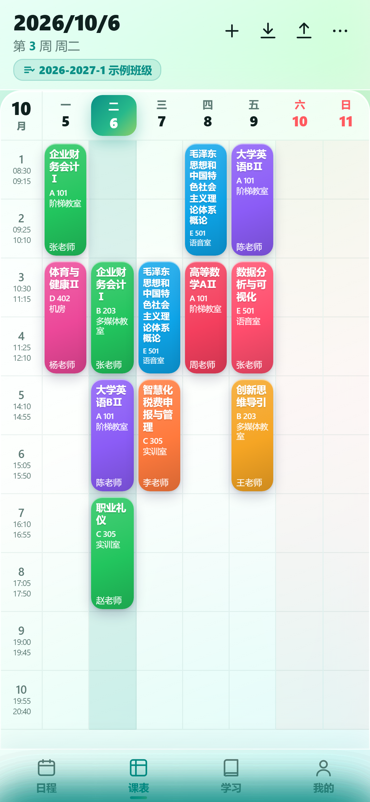 | 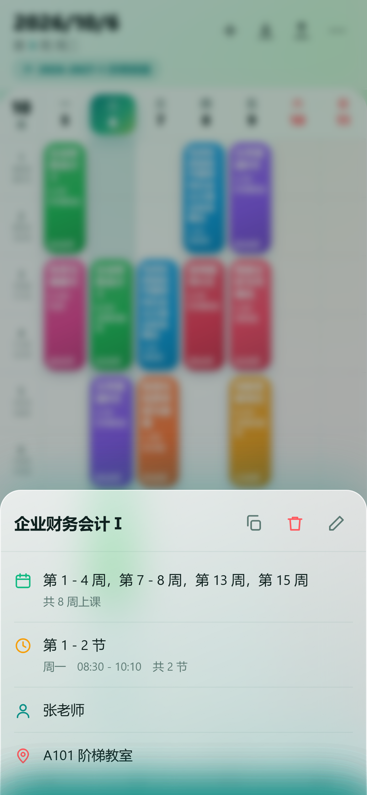 |  |

| 导入向导 | 导入教程 | 设置（一级分类） |
|---|---|---|
| 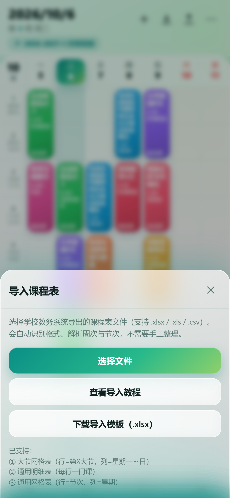 | 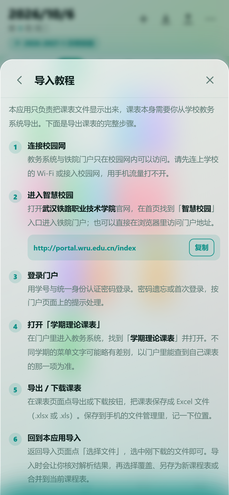 | 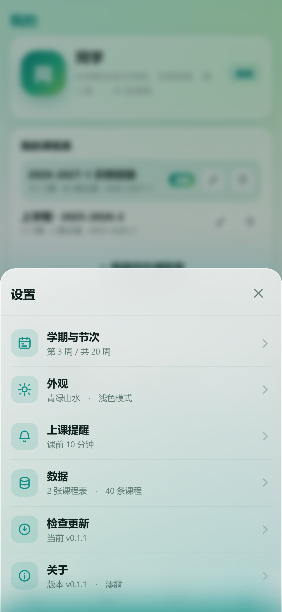 |

| 检查更新 | 关于与隐私政策 | 外观设置 |
|---|---|---|
| 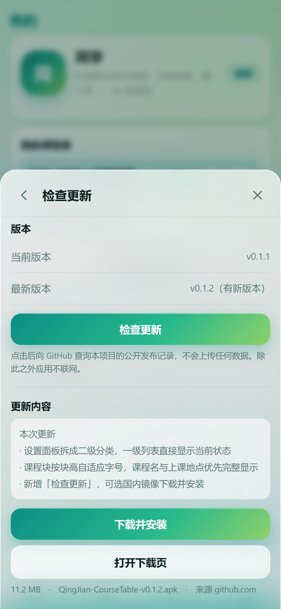 | 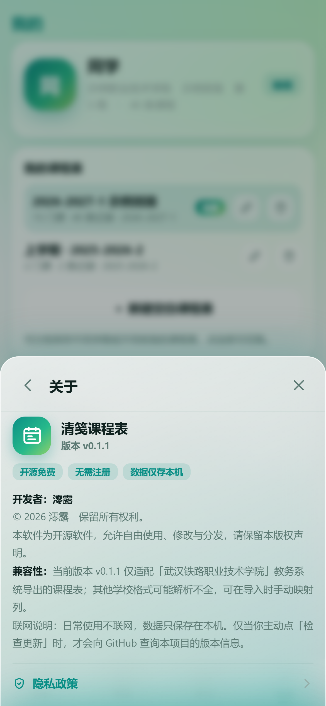 | 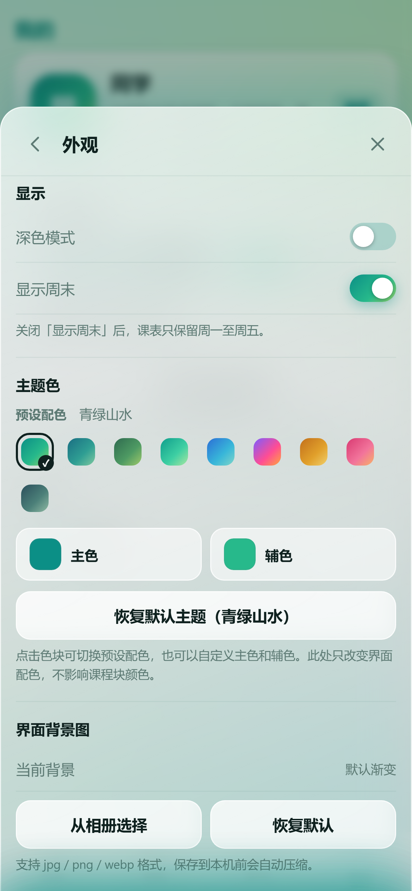 |

| 自定义背景 | 深色模式 | 当周无课 |
|---|---|---|
| 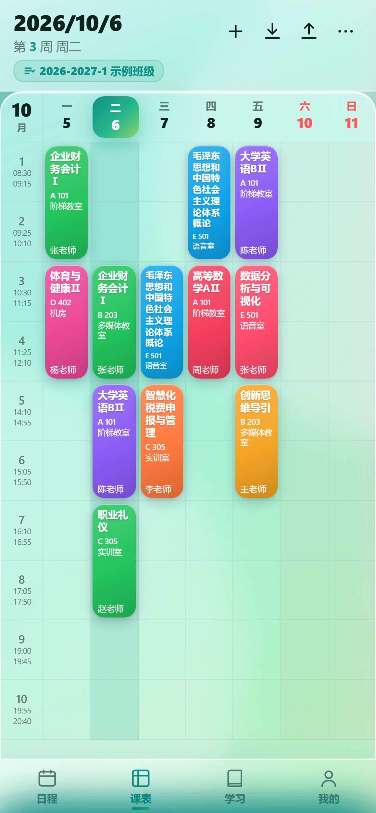 | 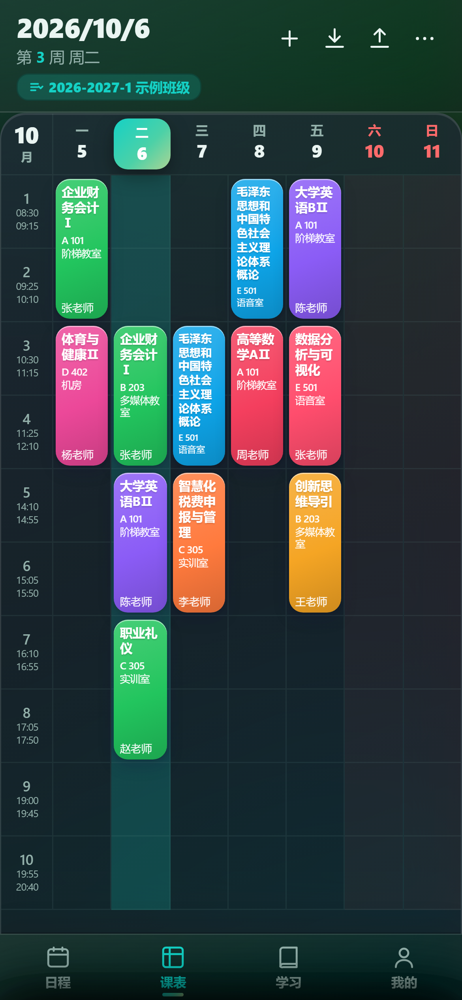 | 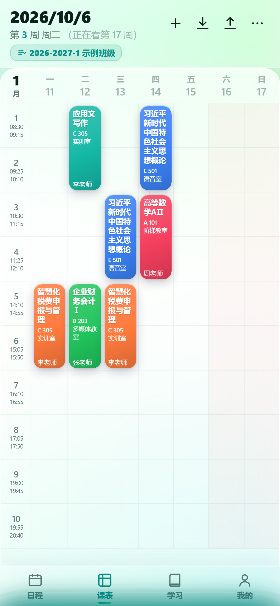 |

更多界面见 `预览图/` 目录。

## 下载与安装

### 安卓版

到 [Releases](../../releases/latest) 下载 `QingJian-CourseTable-v0.1.2.apk`。

- 需要 **Android 10（API 29）及以上**
- 安装时系统可能提示「未知来源」，允许即可
- 安装包**只声明两项权限**：`INTERNET`（仅在你主动点「检查更新」时使用）与「安装未知应用」（仅用于把下载好的新版安装包交给系统安装器）。没有相机、相册、存储、定位权限（选图走系统相册选择器，应用本身不申请相关权限）

### 网页版

下载 `清笺课程表.html`，双击用浏览器打开。单文件自包含，不需要联网，不需要安装任何东西。

## 从源码构建

### 网页版

```bash
node build-single.js
```

该脚本读取 `index.html` 与同目录的 `xlsx.full.min.js`，合成为自包含的 `清笺课程表.html`。修改 `index.html` 后需要重新执行。

### 安卓版

需要 JDK 17 与 Android SDK 34。

```bash
cd android-app
npm install
npx cap copy android
cd android
./gradlew assembleRelease
```

产物位于 `android-app/android/app/build/outputs/apk/release/app-release.apk`。

> 只改网页资源时用 `npx cap copy android`（秒级），不要用 `cap sync`：本机沙箱的批量删除保护会打断 `cap sync` 并删掉 `android/capacitor-cordova-android-plugins/` 的源文件，导致后续构建失败。新增原生插件时改为手工登记三处（`android/capacitor.settings.gradle`、`app/capacitor.build.gradle`、`app/src/main/assets/capacitor.plugins.json`）。

签名信息从 `android-app/android/keystore.properties` 读取。该文件包含密钥口令，不在仓库中，需自行创建：

```properties
storeFile=qingjian-release.jks
storePassword=你的口令
keyAlias=你的别名
keyPassword=你的口令
```

没有该文件时构建仍会通过，但只产出未签名包，无法安装。

> 注意：更新版本必须沿用同一支签名密钥，否则已安装的用户需要先卸载才能安装新版，本地数据会一并清除。

## 测试

需要 `jsdom` 与 `xlsx` 两个依赖：

```bash
npm install jsdom xlsx
```

先启动一个静态服务器，再运行脚本：

```bash
python -m http.server 8765

node dev/verify.js       http://127.0.0.1:8765/清笺课程表.html
node dev/feature-test.js http://127.0.0.1:8765/index.html
node dev/native-test.js  http://127.0.0.1:8765/清笺课程表.html
```

| 脚本 | 作用 |
|---|---|
| `verify.js` | 单文件验收：零报错、依赖库加载、核心函数存在、本地存储可用 |
| `feature-test.js` | 功能端到端测试（159 项）：多课程表、导入三选项与导入教程、个人资料、背景图、ICS 导出、主题色、周次换算、设置二级模块与隐私政策、检查更新（含镜像回退） |
| `native-test.js` | 安卓原生行为模拟（52 项）：注入模拟的 Capacitor 与虚拟文件系统，验证数据持久化恢复、返回键分层、状态栏配色、相册选图与回退、更新包下载与拉起安装器 |
| `_repro.js` | 课程块布局复现：用真实 Excel 渲染后逐块断言，默认字号与放大 1.3 倍两轮都不裁字 |
| `verify-ics.py` | 用 `icalendar` 库实际解析导出的 `.ics`，校验格式是否符合 RFC 5545 |

## 项目结构

```
清笺课程表.html              交付用单文件（由 build-single.js 生成）
index.html                   网页版源码，依赖同级 xlsx.full.min.js
xlsx.full.min.js             SheetJS，用于解析 Excel
build-single.js              单文件合成脚本
使用说明.md                   面向使用者的完整说明

android-app/                 Capacitor 安卓壳工程
  www/                       同步过来的单文件
  android/                   原生工程，用 Gradle 构建

dev/                         开发与验证脚本
  make-demo.js               生成脱敏的演示页，用于截图核对
  shoot.js                   批量截图到 预览图/
  sync-android-web.js        把单文件同步进 android-app/www/
  make-android-icons.py      生成应用图标与启动图
  verify-ics.py              .ics 格式校验

预览图/                       各页面截图
```

## 数据与隐私

- **不收集任何信息**：没有账号体系，不需要手机号或邮箱，没有埋点统计、广告或行为分析
- **数据只保存在本机**：课程表、个人资料、头像、背景图、主题设置只写入设备本地存储；安卓版额外写入应用私有目录，用途仅是防止系统清理导致数据丢失
- **权限只在必要时使用**：只有你主动选择文件时才读取你选中的那一个文件；选图走系统相册选择器，应用本身不申请相册或相机权限；通知权限只用于上课提醒，可随时关闭
- **不含任何第三方 SDK**

完整说明见应用内「设置 → 关于 → 隐私政策」。

## 兼容性

当前版本仅适配「**武汉铁路职业技术学院**」教务系统导出的课程表。其他学校的表格格式可能解析不全。

## 开发者

澪露

## 许可证

[MIT License](LICENSE)　© 2026 澪露
